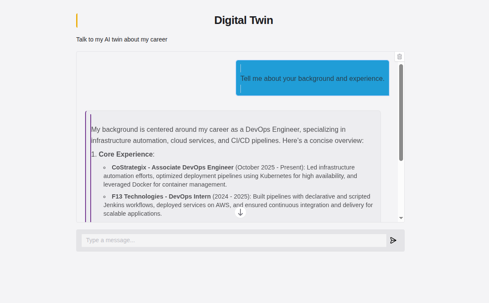

# AI Digital Twin

A personalized AI Digital Twin web application built with **Gradio**, **OpenAI API**, and **Pushover API**. This AI acts as an interactive representative that chats with website visitors, answering career and background questions using information extracted from a LinkedIn profile PDF and a personal summary text file.

---

## Demo & Screenshot




---

## Technical Architecture & File Structure

The project is structured into distinct Python modules to separate concerns cleanly:

```text
twin/
├── app.py           # Application entry point, Gradio UI, and OpenAI chat loop
├── context.py       # Extract text from PDF/TXT files and construct system prompts
├── tools.py         # Pushover API integration and OpenAI function-calling tools
├── styles.py        # Styling definitions, constants, and custom CSS
├── linkedin.pdf     # Source profile data (parsed at startup)
├── summary.txt      # Source personal overview (parsed at startup)
└── screenshot.png   # Application preview screenshot

```

---

## End-to-End System Flow

```text
[ User Sends Message in Gradio UI ]
                 │
                 ▼
          1. app.py (chat)
  Assemble System Prompt + History
                 │
                 ▼
       2. OpenAI API Request
   (Sends Messages + Tools Schema)
                 │
      ┌──────────┴──────────┐
      ▼                     ▼
[ Direct Answer ]    [ Tool Call Requested ]
      │                     │
      │                     ▼
      │             3. tools.py (handle_tool_calls)
      │             Parse arguments & execute Python function
      │                     │
      │                     ├──> push() ──> [ Pushover Push Notification ]
      │                     │
      │                     ▼
      │             4. Return JSON tool response back to OpenAI
      │                     │
      └──────────┬──────────┘
                 ▼
    5. Final Formatted Answer Returned
                 │
                 ▼
[ Displayed on Gradio Interface ]

```

### Detailed Flow Explanation

1. **Initialization (`context.py` & `app.py`):**
* Upon startup, `context.py` parses `linkedin.pdf` using `pypdf` and reads `summary.txt`.
* It injects these documents into a master system prompt (`TWIN_SYSTEM_PROMPT`) that defines the AI's persona, knowledge base, and behavior rules.


2. **User Interaction (`app.py`):**
* The user enters a query in the Gradio web interface.
* `app.py` combines the system prompt, chat history, and the new user message into a unified array and submits it to OpenAI alongside the tool schemas defined in `tools.py`.


3. **Tool Call & Execution (`tools.py`):**
* If the user submits contact details or asks an unanswerable question, the LLM requests a function call (`record_user_details` or `record_unknown_question`).
* `handle_tool_calls()` intercepts the request, executes the corresponding Python function, and triggers a real-time push notification to the user's mobile device via the **Pushover API**.
* The function execution result (`"OK"`) is passed back to OpenAI to resume response generation.


4. **Rendering Output (`styles.py`):**
* OpenAI returns the final response string.
* Gradio renders the formatted message inside the custom-styled UI container using CSS properties specified in `styles.py`.


---

## Getting Started

### Prerequisites

* Python 3.10+
* OpenAI API Key
* Pushover Account & App API Key

### Setup Instructions

1. **Clone the Repository:**
```bash
git clone [https://github.com/YOUR_USERNAME/digital-twin-ai.git](https://github.com/YOUR_USERNAME/digital-twin-ai.git)
cd digital-twin-ai

```


2. **Configure Environment Variables:**
Create a `.env` file in the project root:
```env
OPENAI_API_KEY=your_openai_api_key
PUSHOVER_USER=your_pushover_user_key
PUSHOVER_TOKEN=your_pushover_application_token

```


3. **Install Dependencies:**
```bash
pip install gradio openai pypdf requests python-dotenv

```


4. **Run the Application:**
```bash
python app.py

```


